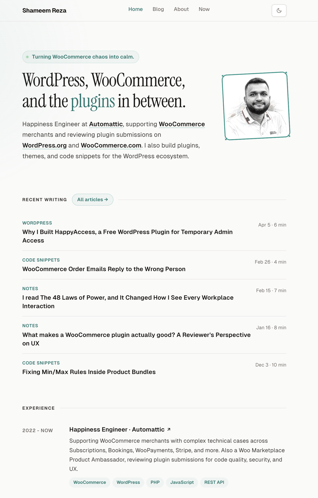

# shameemreza.com

My personal site. Built with [Astro](https://astro.build/), written in MDX, deployed on [Netlify](https://www.netlify.com/).

Previously `shameem.dev`, `shameem.blog`, and `shameem.me`. Now everything lives here.



## What's inside

- Blog posts migrated from WordPress, stored as MDX with frontmatter.
- Categories with paginated listing.
- Command palette search (Cmd+K or Ctrl+K).
- RSS feed at `/rss.xml`.
- Sitemap, canonical URLs, Open Graph, Twitter Cards, and JSON-LD.
- Light and dark mode with system preference detection. Persists across View Transitions.
- Giscus comments (GitHub Discussions).
- Mailchimp newsletter form.
- Now page with live GitHub activity.
- Ko-fi support block on every post.
- Responsive, accessible, zero-JS by default. Astro islands only where needed.

## Running locally

```
npm install
npm run dev
```

The dev server starts at `http://localhost:4321/`.

## Building

```
npm run build
```

Output goes to `dist/`. Preview the production build with:

```
npm run preview
```

## Project structure

```
src/
├── components/     # BaseHead, Header, Footer, CommandPalette, JsonLd, Tldr
├── content/posts/  # MDX blog posts
├── layouts/        # BaseLayout, PostLayout
├── pages/          # index, blog, about, now, contact, privacy, 404, categories
├── styles/         # global.css with design tokens
├── config.ts       # Site config, social links, experience
└── content.config.ts
public/
├── images/         # OG image, avatar
├── uploads/        # Media from WordPress migration and new post images
├── favicon.svg
└── robots.txt
scripts/
├── cleanup-unused-uploads.ts
└── generate-featured-image.ts
```

## Deployment

Netlify picks up `netlify.toml` automatically. It handles:

- Build command and publish directory.
- Custom 404 page.
- Old domain redirects (shameem.dev, shameem.blog, shameem.me).
- Cache headers for static assets.
- Security headers.

## Writing a new post

Create a `.mdx` file in `src/content/posts/`. The filename becomes the slug. A post at `src/content/posts/my-new-post.mdx` will be available at `/my-new-post/`.

```
---
title: "Your post title"
description: "A short summary for SEO and social sharing."
date: 2026-04-16
category: "WordPress"
categorySlug: "wordpress"
featuredImage: "/uploads/your-image.png"
draft: false
---
```

### Frontmatter fields

| Field | Required | Description |
|---|---|---|
| `title` | Yes | Post title. |
| `description` | Yes | Short summary for SEO and social sharing. |
| `date` | Yes | Publish date (ISO format). |
| `updated` | No | Last updated date. Shows "Updated [date]" on the post and sets `dateModified` in JSON-LD. Important for Google. |
| `category` | Yes | Display name, for example "WordPress". |
| `categorySlug` | Yes | URL slug, for example "wordpress". |
| `featuredImage` | No | Path under `/uploads/`. Used as the OG image for social sharing. |
| `featuredImageAlt` | No | Alt text for the featured image. |
| `featured` | No | Set to `true` to pin the post to the top of listings. |
| `draft` | No | Set to `true` to hide the post from the site. |

### What you get for free on every post

Everything below is handled by the layout. You don't have to opt in.

- Reading time estimate next to the category.
- Reading progress bar at the top of the viewport.
- Copy button on every code block.
- Copy-link, share on X, and share on LinkedIn buttons.
- Newsletter CTA (Mailchimp).
- Ko-fi support block.
- Previous and next post navigation (sorted by date).
- Up to two related posts, based on `categorySlug`.
- Giscus comments section.
- JSON-LD `BlogPosting` structured data, including `dateModified` when `updated` is set.

### TL;DR callouts

Use the `<Tldr>` component to add a styled summary block at the top (or end) of a post. Import it once at the top of the MDX file:

```
---
title: "Post title"
date: 2026-04-23
description: "..."
category: "Notes"
categorySlug: "notes"
---

import Tldr from '../../components/Tldr.astro';

<Tldr>
  A one or two paragraph summary of what the post covers. Supports paragraphs, `inline code`, code blocks, and [links](https://example.com).
</Tldr>
```

Custom label:

```
<Tldr label="In short">
  Short summary here.
</Tldr>
```

The callout adapts to light and dark mode automatically and supports code blocks inside it.

### Tables

Regular Markdown tables work out of the box. A rehype plugin in `astro.config.mjs` wraps every table in a `<div class="table-wrap">` so it scrolls horizontally when needed. Column and row separators render in both light and dark mode.

```
| Name pattern | Result |
|---|---|
| `YourBrand Prices for WooCommerce` | Accepted. |
| `WooCommerce Prices` | Not accepted. |
```

### CTA buttons inside posts

Use the `cta-button` class for a call-to-action. Centered by default:

```
<div class="cta-button">
  <a href="https://example.com">Get started</a>
</div>
```

Left-aligned:

```
<div class="cta-button left">
  <a href="https://example.com">Get started</a>
</div>
```

### Images

Drop images into `public/uploads/` and reference them as absolute paths. The path you use in `featuredImage` is the same path you'd use in the post body:

```

```

### Categories

Categories are driven by `category` and `categorySlug` in the frontmatter. A listing page is generated automatically at `/category/<slug>/`. No extra config needed.

### Drafts

Set `draft: true` and the post is excluded from every listing, the RSS feed, the sitemap, related posts, and prev/next navigation. The page route still gets generated, so you can preview it by visiting the URL directly in dev.

### Featured posts

Set `featured: true` to pin the post to the top of listings that look for it.

## Scripts

Two helper scripts live in `scripts/`. Run them with `npx tsx`.

### Generate images with OpenAI

`scripts/generate-featured-image.ts` calls OpenAI's `gpt-image-2` to create an image, compresses it with `sharp` (1200px wide, mozjpeg quality 82), and saves it to `public/uploads/<name>.jpg`. Two modes, same script.

Set up your API key once (it's read via `dotenv`):

```
echo 'OPENAI_API_KEY=sk-...' >> .env
```

#### Featured image for a new post

Pass the post's slug. The prompt is built automatically from the post's `title`, `category`, and `description`, with a fixed visual style (minimalist flat illustration, muted teal palette, no text). The result is saved to `public/uploads/<slug>.jpg` and the `featuredImage` field in the post's frontmatter is written (or re-linked) in place.

```
npx tsx scripts/generate-featured-image.ts my-new-post
```

If `<slug>.jpg` already exists, the API call is skipped and only the frontmatter is updated. To regenerate, delete the JPG first.

#### Ad-hoc images (diagrams, in-post illustrations, anything)

Pass a custom `--prompt` and an `--out` filename. The output goes to `public/uploads/<out>.jpg` and the script prints the Markdown snippet ready to paste into your post.

```
npx tsx scripts/generate-featured-image.ts \
  --prompt "diagram showing the four AI1WM exclude hooks side by side with arrows" \
  --out ai1wm-hooks
```

Output:

```
Paste into your MDX:
  
```

The same style layer (palette, no-text rule, clean lines) is appended automatically, so ad-hoc images match the visual language of your featured images. `--out` must be lowercase letters, numbers, and dashes.

#### Dry run

Add `--dry-run` to either mode to see the full prompt and output path without calling the API or writing files.

```
npx tsx scripts/generate-featured-image.ts my-new-post --dry-run
npx tsx scripts/generate-featured-image.ts --prompt "..." --out test --dry-run
```

### Find and delete unused uploads

`scripts/cleanup-unused-uploads.ts` walks `src/` for references to `/uploads/...`, then lists any file in `public/uploads/` that nothing points at.

Preview first, always:

```
npx tsx scripts/cleanup-unused-uploads.ts --dry-run
```

Delete after you've reviewed the list:

```
npx tsx scripts/cleanup-unused-uploads.ts
```

The scan covers `.astro`, `.ts`, `.tsx`, `.mdx`, `.md`, `.css`, `.js`, and `.json` files. It ignores `node_modules` and `.DS_Store`.

## Small details worth knowing

- Dark mode is set by an inline script in `<head>` before paint, so there's no flash. A matching `astro:after-swap` handler keeps it sticky across View Transitions.
- Google Analytics is loaded lazily via `requestIdleCallback` to stay out of the critical path. Preconnect hints are in `BaseLayout.astro`.
- External links in Markdown get `target="_blank"` and `rel="noopener noreferrer"` via `rehype-external-links`.
- Code blocks use Shiki with the `catppuccin-mocha` theme. Configured in `astro.config.mjs`.
- Fonts are self-hosted from `public/fonts/` and preloaded.
- The command palette is on Cmd+K or Ctrl+K and searches titles, descriptions, and categories.

## License

The source code (layouts, components, styles, config) is open source under [MIT](https://opensource.org/licenses/MIT). Fork it, learn from it, reuse it for your own site.

All content (blog posts, images, text, and media in `src/content/` and `public/uploads/`) is copyrighted. You may not copy, republish, or redistribute the content without written permission. If you spot a bug or want to suggest an improvement, PRs are welcome.
