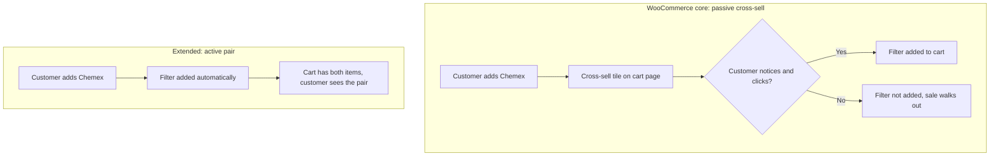

import Tldr from '../../components/Tldr.astro';

WooCommerce has three different ways to link one product to another. Cross-sells. Upsells. Related products. They've been part of core for years, and almost every store I've looked at uses at least one of them.

They share one thing in common: the customer has to click. The cross-sell tile sits on the cart page. The upsell shows up on the product page below the description. Related products land at the bottom of the same page. Each one is a suggestion, and a suggestion only counts when the customer notices it and acts on it.

That contract works fine when the link between two products is a "maybe". You're saying "this might pair well, take a look", and the customer takes a look or skips it.

It breaks down when the link is a "should". A coffee maker that's useless without filters. A printer that's useless without ink. A swatch sample where you can't afford to ship more than one per order regardless of what the cart says. In those cases, the cross-sell tile becomes the difference between a complete order and a half-finished one, and a non-trivial slice of customers walks past it.

This post is about closing that gap. I'll go through how WooCommerce handles linked products in core today, where the contract stops short, and five snippets that take cross-sells from passive suggestions to automatic pairings. Each snippet is one piece of code, works on simple products and variations, and behaves the same way in both the classic cart and the cart block.

## How WooCommerce links products today

There are three fields on every product that connect it to another product. They look similar in the admin, but they each render in a different place and serve a slightly different purpose.

### Cross-sells

A cross-sell appears on the cart page after the customer has added a product that points to it. The intent is "you've already decided to buy X, here is something that goes with it".

You set them up under Product → Linked Products → Cross-sells. The IDs get stored as the `_crosssell_ids` post meta on the product. The cart template at `templates/cart/cross-sells.php` reads them through `WC_Cart::get_cross_sells()` and renders product tiles below the cart items.

The customer sees the tile, decides whether to click, and the pairing depends entirely on that click.

### Upsells

Upsells live on the single product page, below the long description. They're typically used for "you're looking at X, but Y is the better fit for you". Stored as `_upsell_ids` post meta. Rendered through `woocommerce_upsell_display()` from `templates/single-product/up-sells.php`.

Same passive shape. The customer sees, the customer decides.

### Related products

Related products are different from the other two because they're not configured per product. WooCommerce picks them automatically based on shared categories and tags. They render at the bottom of the single product page below the upsells, and the selection logic lives in `wc_get_related_products()`.

The thing all three share is the contract: WooCommerce surfaces the suggestion, the customer takes it from there. That contract is fine for products where the connection is a "maybe". It falls short when the connection is a "should".

## Where the contract stops short

Take a small coffee gear shop on WooCommerce. They sell a Chemex coffee maker for $50, and every customer who buys one also needs paper filters at $10 a pack. The cross-sell field on the Chemex points to the filters. Half the customers see the tile and click. The other half land on the cart, scan the order summary, and head to checkout without scrolling down.

Those customers wanted both items. They just didn't think to look further than the line item they came for.



What we actually want is to tighten the contract. When the main product is added, the companion goes with it. Not as a suggestion. As a pair. WooCommerce gives us the hooks to do that, and the rest of the post is five snippets that walk from soft pairing on the product page through a fully locked pair to a polished cart UX.

## Setting up the shared config

Before the four feature snippets, there's a small helper file that defines the pairs and keeps the pair flag in cart data across page loads. Each of the snippets below reuses these helpers, so this one goes in first.

```
/**
 * Define which products are paired with which.
 *
 * Returns an array keyed by parent product or variation ID, with the value
 * being the companion product or variation ID. The lookup checks the
 * variation ID first and falls back to the parent product ID.
 *
 * Wrap the pairs in a filter so dynamic logic (category, customer role,
 * country) can extend the static list later.
 *
 * @since 1.0.0
 *
 * @return array<int,int> Map of main product/variation ID => companion ID.
 */
function wooninja_get_companion_product_pairs() {
	$pairs = array(
		// Format: parent product or variation ID => companion product or variation ID.
		// 123  => 456,    // Pair simple product 123 with simple product 456.
		// 789  => 1011,   // Pair variation 789 with simple product 1011.
		// 1012 => 1013,   // Pair parent product 1012 (every variation) with product 1013.
	);

	return apply_filters( 'wooninja_companion_product_pairs', $pairs );
}

/**
 * Look up the companion ID for a given product/variation pair.
 *
 * Variation IDs win over parent product IDs, so a merchant can pair a
 * specific variation without affecting the rest of the variable product.
 *
 * @since 1.0.0
 *
 * @param int $product_id   The parent product ID.
 * @param int $variation_id Optional variation ID, if the customer added a variation.
 * @return int Companion product or variation ID, or 0 if no pair is configured.
 */
function wooninja_get_companion_for( $product_id, $variation_id = 0 ) {
	$pairs = wooninja_get_companion_product_pairs();

	if ( $variation_id && isset( $pairs[ $variation_id ] ) ) {
		return (int) $pairs[ $variation_id ];
	}

	if ( isset( $pairs[ $product_id ] ) ) {
		return (int) $pairs[ $product_id ];
	}

	return 0;
}

/**
 * Restore the paired_with flag when the cart is rebuilt from session.
 *
 * WooCommerce stores cart_item_data in the persisted cart, but the rebuilt
 * cart item does not pick up custom keys automatically. Without this hook,
 * the lock and quantity sync below would only work until the customer
 * reloaded the cart page.
 *
 * @since 1.0.0
 *
 * @param array<string,mixed> $cart_item The rebuilt cart item.
 * @param array<string,mixed> $values    The persisted cart item values.
 * @return array<string,mixed> Cart item with paired_with restored.
 */
function wooninja_restore_companion_link_from_session( $cart_item, $values ) {
	if ( ! empty( $values['paired_with'] ) ) {
		$cart_item['paired_with'] = $values['paired_with'];
	}

	return $cart_item;
}
add_filter( 'woocommerce_get_cart_item_from_session', 'wooninja_restore_companion_link_from_session', 10, 2 );
```

[View this snippet on GitHub Gist →](https://gist.github.com/shameemreza)

### How it works

The two helpers (`wooninja_get_companion_product_pairs` and `wooninja_get_companion_for`) hold the static map of pairs and the lookup logic. Variation IDs win over parent product IDs in the lookup, so you can pair "Chemex 6-cup" with paper filters specifically, or pair the entire Chemex parent product so every variation gets the same filters.

The `woocommerce_get_cart_item_from_session` filter is small but essential. WooCommerce persists cart item data through PHP sessions, but when the cart rebuilds on each page load, custom keys like `paired_with` are not picked up automatically. The filter is the standard WooCommerce extension point for restoring custom cart item data, and any code that stores flags on cart items needs it to survive a page refresh.

### Where to add this code

Pick whichever fits your workflow. Each option below works the same way:

- **Code snippets plugin:** Something like [WPCode](https://wordpress.org/plugins/insert-headers-and-footers/) or [Code Snippets](https://wordpress.org/plugins/code-snippets/) is the cleanest if you don't want to touch theme files.
- **Custom plugin file:** A small standalone plugin in `wp-content/plugins/`. Best if you use version control.
- **Child theme's functions.php:** Fastest, but make sure you're using a child theme so updates don't wipe it out.

Add this block first. The four feature snippets below assume these helpers exist.

## Showing paired products on the product page

The cart page is too late. By the time the customer has added the Chemex, you're competing with the checkout button for attention. Showing the pair on the product page sets the expectation early, before the click.

This snippet adds a small line under the Add to Cart button that says "Also added when you buy this: Paper Filters ($10)". It works on simple products and variable products, in classic themes and block themes, because it hooks into the standard add-to-cart form template that all of them render.

```
/**
 * Show the paired companion product under the Add to Cart button on the
 * single product page.
 *
 * Hooks into woocommerce_after_add_to_cart_button so it appears on simple
 * and variable products, in both classic and block-based product page
 * templates. The companion is read from the static pair map defined in
 * wooninja_get_companion_for().
 *
 * Skips the line if the companion is unpurchasable, out of stock, or
 * unpublished, so the notice never points to a product the customer
 * cannot actually receive.
 *
 * @since 1.0.0
 *
 * @return void
 */
function wooninja_show_companion_on_product_page() {
	global $product;

	if ( ! $product instanceof WC_Product ) {
		return;
	}

	$companion_id = wooninja_get_companion_for( $product->get_id() );

	if ( ! $companion_id ) {
		return;
	}

	$companion = wc_get_product( $companion_id );

	if ( ! $companion instanceof WC_Product || ! $companion->is_purchasable() ) {
		return;
	}

	printf(
		'<p class="companion-product-notice"><small>%s</small></p>',
		sprintf(
			/* translators: 1: companion product name, 2: companion product price */
			wp_kses_post( __( 'Also added when you buy this: <strong>%1$s</strong> (%2$s)' ) ),
			esc_html( $companion->get_name() ),
			wp_kses_post( $companion->get_price_html() )
		)
	);
}
add_action( 'woocommerce_after_add_to_cart_button', 'wooninja_show_companion_on_product_page' );
```

[View this snippet on GitHub Gist →](https://gist.github.com/shameemreza)

### How it works

The hook `woocommerce_after_add_to_cart_button` fires inside the add-to-cart form template, after the button renders. The function pulls the global `$product`, looks up its companion through `wooninja_get_companion_for()`, and prints a small notice if there's a match.

For variable products, the global `$product` is the variable parent. The lookup uses the parent product ID, so all variations of the same product show the same companion. If you need the notice to update dynamically as the customer picks a variation, that requires a small JavaScript hook into the variations form, which I'd handle as a follow-up snippet rather than building it into this one.

The `is_purchasable()` check skips the line for products that are out of stock, hidden, password-protected, or unpublished. The notice never points to something the customer can't actually receive.

### Where to add this code

Same options as the shared config:

- **Code snippets plugin** like WPCode or Code Snippets.
- **Custom plugin file** in `wp-content/plugins/`.
- **Child theme's functions.php**.

### What to expect

After adding this snippet, every product page with a configured companion shows a one-line notice below the Add to Cart button:

> Also added when you buy this: **Paper Filters** ($10)

The line styles itself as a `<small>` paragraph with the class `companion-product-notice`, so you can style it through your theme if you want it bigger, centered, or boxed. It does not change anything about the cart yet. The customer still has to click Add to Cart for both items to appear, and the next snippet handles that.


## Auto-adding a companion when the main product is added

This is the snippet that does the actual pairing. When the customer adds the Chemex, the filters add themselves to the cart, in the same quantity, in the same step.

The snippet hooks `woocommerce_add_to_cart`, which fires on every add-to-cart action regardless of whether the customer is using the classic cart, the cart block, or the Store API directly. WooCommerce core fires this action from `WC_Cart::add_to_cart()`. The Store API mirrors the same contract from its own `CartController::add_to_cart()` and fires `woocommerce_add_to_cart` with the same six arguments. One handler covers both flows.

```
/**
 * Automatically add the configured companion product when the main product
 * is added to the cart.
 *
 * Hooks woocommerce_add_to_cart, which fires for both the classic cart and
 * the cart block. WooCommerce core fires this action from
 * WC_Cart::add_to_cart(), and the Store API mirrors the same contract from
 * CartController::add_to_cart() (firing woocommerce_add_to_cart with the
 * same six arguments). The companion is added with a paired_with flag in
 * cart_item_data so the lock and quantity sync snippets can identify it.
 *
 * Handles simple products and variations on both the main product side and
 * the companion side. If the companion is a variation, it is added with
 * both the parent ID and the variation ID, which is how
 * WC_Cart::add_to_cart() expects variation cart items.
 *
 * @since 1.0.0
 *
 * @param string                $cart_item_key  The cart item key of the just-added item.
 * @param int                   $product_id     The product ID of the just-added item.
 * @param int                   $quantity       The quantity that was added.
 * @param int                   $variation_id   The variation ID, if applicable.
 * @param array<string,mixed>   $variation      The variation attributes, if applicable.
 * @param array<string,mixed>   $cart_item_data The cart item data the item was added with.
 * @return void
 */
function wooninja_auto_add_companion_to_cart( $cart_item_key, $product_id, $quantity, $variation_id, $variation, $cart_item_data ) {

	// If the just-added item is itself a companion (we're adding it from inside this function), stop.
	if ( ! empty( $cart_item_data['paired_with'] ) ) {
		return;
	}

	$companion_id = wooninja_get_companion_for( (int) $product_id, (int) $variation_id );

	if ( ! $companion_id ) {
		return;
	}

	$companion = wc_get_product( $companion_id );

	if ( ! $companion instanceof WC_Product || ! $companion->is_in_stock() ) {
		return;
	}

	// If a companion linked to this main item is already in the cart, do not add a duplicate.
	foreach ( WC()->cart->get_cart() as $item ) {
		if ( ! empty( $item['paired_with'] ) && $item['paired_with'] === $cart_item_key ) {
			return;
		}
	}

	$args = array(
		'paired_with' => $cart_item_key,
	);

	if ( $companion->is_type( 'variation' ) ) {
		WC()->cart->add_to_cart( $companion->get_parent_id(), $quantity, $companion_id, array(), $args );
	} else {
		WC()->cart->add_to_cart( $companion_id, $quantity, 0, array(), $args );
	}

	$main_product = wc_get_product( $variation_id ?: $product_id );

	if ( $main_product instanceof WC_Product ) {
		wc_add_notice(
			sprintf(
				/* translators: 1: companion product name, 2: main product name */
				esc_html__( '%1$s was paired with %2$s and added to your cart.' ),
				esc_html( $companion->get_name() ),
				esc_html( $main_product->get_name() )
			),
			'success'
		);
	}
}
add_action( 'woocommerce_add_to_cart', 'wooninja_auto_add_companion_to_cart', 20, 6 );
```

[View this snippet on GitHub Gist →](https://gist.github.com/shameemreza)

### How it works

The function runs on every add-to-cart action. The first check stops it from running on items that were added by the function itself, which prevents an infinite loop where the companion adds another companion. After that, it looks up the configured companion through `wooninja_get_companion_for()`, validates the product, and adds it to the cart with `paired_with` in the cart item data.

For variable products, the lookup checks the variation ID first, then falls back to the parent product ID. The companion is added the same way: if the merchant pairs to a variation, the snippet passes both the parent ID and the variation ID to `WC_Cart::add_to_cart()`, which is the signature WooCommerce expects for variation cart items.

The duplicate check loops through the existing cart and bails if a companion linked to this main item is already there. This handles the case where the customer adds the same Chemex twice without ending up with two separate filter line items pointing to two different cart keys.

The `wc_add_notice()` call shows a one-line success message at the top of the page, in the same notice strip WooCommerce uses for its own "Product added to cart" confirmations. The notice works in classic themes and in the cart block, because the block renders WooCommerce notices through the same channel.

### Where to add this code

- **Code snippets plugin** like WPCode or Code Snippets.
- **Custom plugin file** in `wp-content/plugins/`.
- **Child theme's functions.php**.

### What to expect

After adding this snippet, clicking Add to Cart on a paired product adds both items in one step. The customer sees the main product as the line they clicked, and the companion appears below it with the same quantity. A success notice shows at the top of the page explaining the pairing.

The customer can still adjust quantities or remove either item from the cart. That's intentional. This snippet is the soft pair. The next snippet handles the hard pair where the companion follows the parent and the customer can't break them apart.


## Locking the pair in both carts

For some pairings, the companion isn't optional. The Chemex ships with one specific filter brand and the merchant doesn't want the customer pulling it out at the cart. The course comes with the workbook. The kit comes with both items, no exceptions.

This snippet locks the pair so the customer can't change the companion's quantity or remove it independently. It hits the right hooks for the classic cart and the cart block in one block of code, so the same snippet works regardless of which cart UI your store uses.

```
/*
 * Lock paired companion items in the cart so the customer cannot change
 * the quantity or remove them independently.
 *
 * Works in both the classic cart and the cart block from one piece of code:
 *
 *  - Classic cart: hides the remove link and renders the quantity as a
 *    static number through woocommerce_cart_item_remove_link and
 *    woocommerce_cart_item_quantity.
 *  - Cart block: locks the min/max quantity through the Store API filters
 *    woocommerce_store_api_product_quantity_minimum and
 *    woocommerce_store_api_product_quantity_maximum.
 *  - Both carts: when the main item is removed, the companion is removed
 *    automatically through woocommerce_cart_item_removed.
 *  - Both carts: a "Pairs with" caption is added to the companion through
 *    woocommerce_get_item_data, so the customer understands why the
 *    controls are locked.
 */

/**
 * Hide the remove link for paired companion items in the classic cart.
 *
 * @since 1.0.0
 *
 * @param string $link          The default remove link HTML.
 * @param string $cart_item_key The cart item key.
 * @return string Empty string for paired items, original link otherwise.
 */
function wooninja_hide_companion_remove_link( $link, $cart_item_key ) {
	$cart_item = WC()->cart ? WC()->cart->get_cart_item( $cart_item_key ) : null;

	if ( is_array( $cart_item ) && ! empty( $cart_item['paired_with'] ) ) {
		return '';
	}

	return $link;
}
add_filter( 'woocommerce_cart_item_remove_link', 'wooninja_hide_companion_remove_link', 10, 2 );

/**
 * Render the quantity for paired companion items as a static number in the
 * classic cart, replacing the editable input.
 *
 * @since 1.0.0
 *
 * @param string              $product_quantity The default quantity HTML.
 * @param string              $cart_item_key    The cart item key.
 * @param array<string,mixed> $cart_item        The cart item.
 * @return string Static number for paired items, original HTML otherwise.
 */
function wooninja_lock_companion_quantity_classic( $product_quantity, $cart_item_key, $cart_item ) {
	if ( is_array( $cart_item ) && ! empty( $cart_item['paired_with'] ) ) {
		return (string) $cart_item['quantity'];
	}

	return $product_quantity;
}
add_filter( 'woocommerce_cart_item_quantity', 'wooninja_lock_companion_quantity_classic', 10, 3 );

/**
 * Lock the min and max quantity for paired companion items in the cart block.
 *
 * The Store API uses the same filter for both min and max, set to the
 * current quantity to disable the plus and minus buttons.
 *
 * @since 1.0.0
 *
 * @param int|null            $value     The default min or max value.
 * @param WC_Product          $product   The product object.
 * @param array<string,mixed> $cart_item The cart item.
 * @return int|null Locked quantity for paired items, original value otherwise.
 */
function wooninja_lock_companion_qty_block( $value, $product, $cart_item ) {
	if ( is_array( $cart_item ) && ! empty( $cart_item['paired_with'] ) ) {
		return (int) $cart_item['quantity'];
	}

	return $value;
}
add_filter( 'woocommerce_store_api_product_quantity_minimum', 'wooninja_lock_companion_qty_block', 10, 3 );
add_filter( 'woocommerce_store_api_product_quantity_maximum', 'wooninja_lock_companion_qty_block', 10, 3 );

/**
 * Remove paired companion items when the main item is removed from the cart.
 *
 * Fires for both the classic cart and the cart block.
 *
 * @since 1.0.0
 *
 * @param string $cart_item_key The cart item key of the removed item.
 * @return void
 */
function wooninja_cascade_remove_companion( $cart_item_key ) {
	if ( ! WC()->cart ) {
		return;
	}

	foreach ( WC()->cart->cart_contents as $key => $item ) {
		if ( ! empty( $item['paired_with'] ) && $item['paired_with'] === $cart_item_key ) {
			WC()->cart->remove_cart_item( $key );
		}
	}
}
add_action( 'woocommerce_cart_item_removed', 'wooninja_cascade_remove_companion' );

/**
 * Show a "Pairs with: Main Product" caption under the companion in the cart.
 *
 * Works in both the classic cart and the cart block (the cart block
 * formats item data through the same filter via the Store API).
 *
 * @since 1.0.0
 *
 * @param array<int,array<string,mixed>> $data      Existing item data.
 * @param array<string,mixed>            $cart_item The cart item.
 * @return array<int,array<string,mixed>> Item data with the linked caption added.
 */
function wooninja_show_companion_link_in_cart( $data, $cart_item ) {
	if ( empty( $cart_item['paired_with'] ) ) {
		return $data;
	}

	$parent_item = WC()->cart ? WC()->cart->get_cart_item( $cart_item['paired_with'] ) : null;

	if ( ! is_array( $parent_item ) || empty( $parent_item['data'] ) || ! $parent_item['data'] instanceof WC_Product ) {
		return $data;
	}

	$data[] = array(
		'name'    => __( 'Pairs with' ),
		'display' => $parent_item['data']->get_name(),
	);

	return $data;
}
add_filter( 'woocommerce_get_item_data', 'wooninja_show_companion_link_in_cart', 10, 2 );
```

[View this snippet on GitHub Gist →](https://gist.github.com/shameemreza)

### How it works

The snippet bundles five hooks that together make the companion behave as a locked extension of the main item. They run side by side, and the right ones take effect depending on which cart UI is rendering at the moment.

For the classic cart, `woocommerce_cart_item_remove_link` returns an empty string for paired items, which removes the remove anchor from the row, and `woocommerce_cart_item_quantity` returns the quantity as plain text instead of an editable input.

For the cart block, the same lock is applied through the Store API, which is the only PHP-level surface the cart block reads from. `woocommerce_store_api_product_quantity_minimum` and `woocommerce_store_api_product_quantity_maximum` set the min and max to the current quantity, so the plus and minus buttons in the block UI are disabled. The cart block builds its UI from JavaScript, but the quantity controls respect the values the Store API hands back.

The cascade hook handles removal in both carts. When the main item is removed, `woocommerce_cart_item_removed` fires and any companion linked to it is removed in the same pass.

The "Pairs with" line is added through `woocommerce_get_item_data`, which the classic cart and the Store API's cart item formatter both respect. The caption shows up below the product title in both UIs and tells the customer why the controls are different on that line.

There is one honest tradeoff in the cart block. The Store API filters lock the quantity, but they do not hide the remove button. WooCommerce doesn't expose a PHP-level filter to hide a per-item button in the cart block UI. Doing that requires a JavaScript bundle that registers a slot fill against the cart block's component tree. In practice, most customers won't remove the companion alone (it's small, the parent is what they came for), but if your store needs the lock to be absolute in the cart block, that's the moment a maintained plugin starts to be worth its price.

### Where to add this code

- **Code snippets plugin** like WPCode or Code Snippets.
- **Custom plugin file** in `wp-content/plugins/`.
- **Child theme's functions.php**.

This snippet pairs naturally with the auto-add snippet above. Without auto-add, no companion items end up in the cart with a `paired_with` flag, so the lock has nothing to apply to.

### What to expect

After adding this snippet, paired companion items in the cart show up with the quantity locked, no remove link, and a "Pairs with: Main Product" caption below the title. Removing the main item removes the companion in the same step. The customer sees the same behavior in the classic cart and the cart block.


## Syncing the paired quantity

The lock above stops the customer from changing the companion's quantity directly. This snippet keeps the companion's quantity matched to the main product's quantity automatically. If the customer increases the Chemex from 1 to 3, the paper filters go from 1 to 3 in the same update.

```
/**
 * Sync the paired companion quantity to the main product quantity.
 *
 * Hooks woocommerce_after_cart_item_quantity_update, which fires from
 * WC_Cart::set_quantity() in both the classic cart and the cart block (the
 * Store API quantity update endpoint calls set_quantity() internally and
 * triggers the same action).
 *
 * Skips companions that are sold individually so the snippet does not try
 * to push them past their quantity cap.
 *
 * @since 1.0.0
 *
 * @param string $cart_item_key The cart item key of the updated item.
 * @param int    $quantity      The new quantity.
 * @return void
 */
function wooninja_sync_companion_quantity( $cart_item_key, $quantity ) {
	if ( ! WC()->cart ) {
		return;
	}

	foreach ( WC()->cart->cart_contents as $key => $item ) {

		if ( empty( $item['paired_with'] ) || $item['paired_with'] !== $cart_item_key ) {
			continue;
		}

		$companion_product = $item['data'] ?? null;

		if ( $companion_product instanceof WC_Product && $companion_product->is_sold_individually() ) {
			continue;
		}

		WC()->cart->set_quantity( $key, (int) $quantity );
	}
}
add_action( 'woocommerce_after_cart_item_quantity_update', 'wooninja_sync_companion_quantity', 10, 2 );
```

[View this snippet on GitHub Gist →](https://gist.github.com/shameemreza)

### How it works

The hook `woocommerce_after_cart_item_quantity_update` fires from `WC_Cart::set_quantity()`, which is the method called by both the classic cart's quantity update form and the Store API's quantity update endpoint. So a quantity change in the cart block triggers this hook just as a quantity change in the classic cart does.

The function loops through cart contents, finds items whose `paired_with` matches the just-updated cart item, and sets their quantity to match. The `is_sold_individually()` check skips companions that are limited to one per order, so the snippet does not try to push them past their cap and end up with an inconsistent cart.

When the main item's quantity goes to zero, `WC_Cart::set_quantity()` calls `WC_Cart::remove_cart_item()` instead of firing the update hook, which then triggers the cascade in the lock snippet. The two snippets work together cleanly without overlap.

### Where to add this code

- **Code snippets plugin** like WPCode or Code Snippets.
- **Custom plugin file** in `wp-content/plugins/`.
- **Child theme's functions.php**.

This snippet uses the `paired_with` flag set by the auto-add snippet, so install auto-add first.

### What to expect

After adding this snippet, changing the main product's quantity in the cart updates the companion's quantity to match. It works in both the classic cart and the cart block. If the companion is sold individually, the snippet leaves its quantity alone and the customer keeps the single companion no matter how many of the main product they buy.


## Polishing the pair across the cart's lifecycle

The four snippets above handle the core of the pairing flow. Adding the pair, locking it, removing it together, syncing the quantity. Once they're in place, a few rough edges show up in real cart use.

The companion lands at the bottom of the cart instead of right under the parent. The Undo link after a removal only brings back the parent. A customer who already had the companion in their cart sees two line items for the same product after they add the parent. A customer who clicks "Order again" on a past order ends up with the companion as a regular line item instead of a locked pair.

This snippet bundles the polish for those cases. Six functions, all using the `paired_with` flag the earlier snippets set, all hooked into cart lifecycle events that fire across both cart UIs.

```
/*
 * Polish the pair across the cart's lifecycle so the cart looks and behaves
 * the way the customer expects in every state:
 *
 *  - Reorder cart contents so the companion sits directly under its parent.
 *  - Add CSS classes so the parent and child rows can be styled together.
 *  - Restore the companion when the parent is restored via the cart Undo link.
 *  - Remove orphan companions if the parent is gone for any reason.
 *  - Dedupe a manual copy of the companion against the auto-paired one.
 *  - Re-apply the paired flag when the customer reorders a past order.
 */

/**
 * Reorder cart contents so each companion sits directly under its parent.
 *
 * Without this, a companion added through woocommerce_add_to_cart lands at
 * the end of the cart contents array, which means it renders at the bottom
 * of the cart in both the classic cart and the cart block. Reordering the
 * underlying cart_contents array is what both UIs render from, so this one
 * function handles both.
 *
 * @since 1.0.0
 *
 * @return void
 */
function wooninja_reorder_cart_with_companions() {
	if ( ! WC()->cart ) {
		return;
	}

	$contents             = WC()->cart->cart_contents;
	$companions_by_parent = array();

	foreach ( $contents as $key => $item ) {
		if ( ! empty( $item['paired_with'] ) ) {
			$companions_by_parent[ $item['paired_with'] ][ $key ] = $item;
		}
	}

	if ( ! $companions_by_parent ) {
		return;
	}

	$ordered = array();

	foreach ( $contents as $key => $item ) {
		if ( ! empty( $item['paired_with'] ) ) {
			continue;
		}

		$ordered[ $key ] = $item;

		if ( isset( $companions_by_parent[ $key ] ) ) {
			foreach ( $companions_by_parent[ $key ] as $companion_key => $companion_item ) {
				$ordered[ $companion_key ] = $companion_item;
			}
		}
	}

	WC()->cart->cart_contents = $ordered;
}
add_action( 'woocommerce_cart_loaded_from_session', 'wooninja_reorder_cart_with_companions', 20 );

/**
 * Add CSS classes to cart rows so a companion and its parent can be styled
 * together in the classic cart.
 *
 * Adds 'companion-child' to the companion row and 'has-companion' to the
 * parent row that owns at least one companion.
 *
 * The cart block does not use this filter for class names, so the styling
 * applied through these classes is classic-cart only. Visual differentiation
 * inside the cart block requires CSS targeting the block's own class names.
 *
 * @since 1.0.0
 *
 * @param string              $classes       The default class string.
 * @param array<string,mixed> $cart_item     The cart item.
 * @param string              $cart_item_key The cart item key.
 * @return string Class string with the companion classes appended where applicable.
 */
function wooninja_add_companion_cart_classes( $classes, $cart_item, $cart_item_key ) {
	if ( ! is_string( $classes ) || ! is_array( $cart_item ) || ! is_string( $cart_item_key ) ) {
		return $classes;
	}

	if ( ! empty( $cart_item['paired_with'] ) ) {
		return $classes . ' companion-child';
	}

	if ( WC()->cart ) {
		foreach ( WC()->cart->get_cart() as $other_item ) {
			if ( ! empty( $other_item['paired_with'] ) && $other_item['paired_with'] === $cart_item_key ) {
				return $classes . ' has-companion';
			}
		}
	}

	return $classes;
}
add_filter( 'woocommerce_cart_item_class', 'wooninja_add_companion_cart_classes', 10, 3 );

/**
 * Restore companion items when the parent item is restored from the cart's
 * removed_cart_contents store via the Undo link.
 *
 * The classic cart's removal notice exposes an Undo action that calls
 * WC_Cart::restore_cart_item(). When the parent is brought back, this
 * function looks at the removed contents for any companion that was tied to
 * that parent and restores it as well.
 *
 * @since 1.0.0
 *
 * @param string $cart_item_key The cart item key of the just-restored item.
 * @return void
 */
function wooninja_restore_companions_on_undo( $cart_item_key ) {
	if ( ! WC()->cart ) {
		return;
	}

	foreach ( WC()->cart->removed_cart_contents as $key => $item ) {
		if ( ! empty( $item['paired_with'] ) && $item['paired_with'] === $cart_item_key ) {
			WC()->cart->restore_cart_item( $key );
		}
	}
}
add_action( 'woocommerce_cart_item_restored', 'wooninja_restore_companions_on_undo' );

/**
 * Remove orphan companions whose parent is no longer in the cart.
 *
 * Defensive cleanup for edge cases where a companion ends up in the cart
 * without its parent (a race condition during checkout, a third-party
 * plugin removing the parent without firing the standard hooks, etc.).
 *
 * Runs once per page load on woocommerce_cart_loaded_from_session.
 *
 * @since 1.0.0
 *
 * @return void
 */
function wooninja_remove_orphan_companions() {
	if ( ! WC()->cart ) {
		return;
	}

	$contents = WC()->cart->get_cart();

	foreach ( $contents as $key => $item ) {
		if ( ! empty( $item['paired_with'] ) && ! isset( $contents[ $item['paired_with'] ] ) ) {
			WC()->cart->remove_cart_item( $key );
		}
	}
}
add_action( 'woocommerce_cart_loaded_from_session', 'wooninja_remove_orphan_companions', 10 );

/**
 * Remove a manually-added copy of the companion when an auto-paired copy
 * already exists in the cart.
 *
 * Without this, a customer who already had the companion in their cart
 * before adding the parent ends up with two separate line items for the
 * same product (the manual one and the auto-paired one). The auto-paired
 * one wins because it carries the lock and the cascade behavior.
 *
 * @since 1.0.0
 *
 * @return void
 */
function wooninja_dedupe_manual_companions() {
	if ( ! WC()->cart ) {
		return;
	}

	$auto_paired_product_ids   = array();
	$auto_paired_variation_ids = array();

	foreach ( WC()->cart->get_cart() as $item ) {
		if ( ! empty( $item['paired_with'] ) ) {
			$auto_paired_product_ids[]   = (int) $item['product_id'];
			$auto_paired_variation_ids[] = (int) ( $item['variation_id'] ?? 0 );
		}
	}

	if ( ! $auto_paired_product_ids ) {
		return;
	}

	foreach ( WC()->cart->get_cart() as $key => $item ) {
		if ( ! empty( $item['paired_with'] ) ) {
			continue;
		}

		$variation_id = (int) ( $item['variation_id'] ?? 0 );
		$product_id   = (int) $item['product_id'];

		$matches_variation = $variation_id && in_array( $variation_id, $auto_paired_variation_ids, true );
		$matches_product   = ! $variation_id && in_array( $product_id, $auto_paired_product_ids, true );

		if ( $matches_variation || $matches_product ) {
			WC()->cart->remove_cart_item( $key );
		}
	}
}
add_action( 'woocommerce_cart_loaded_from_session', 'wooninja_dedupe_manual_companions', 15 );

/**
 * Re-apply the paired_with flag when a customer clicks "Order again" on a
 * past order.
 *
 * The Order again flow rebuilds the cart from the order line items but
 * does not preserve custom cart_item_data flags like paired_with. Without
 * this, the companion comes back as a regular cart item, missing the lock
 * and the cascade. This function walks the rebuilt cart, finds parents
 * whose pair config still points at one of the included items, and tags
 * the companion line with paired_with again.
 *
 * The cart array is passed by reference (woocommerce_ordered_again uses
 * do_action_ref_array), so direct modification is the expected pattern.
 *
 * @since 1.0.0
 *
 * @param int                            $order_id    The order ID being reordered.
 * @param array<int,WC_Order_Item>       $order_items The order items.
 * @param array<string,array<string,mixed>> $cart     The rebuilt cart, passed by reference.
 * @return void
 */
function wooninja_reapply_paired_flag_on_reorder( $order_id, $order_items, &$cart ) {
	if ( ! is_array( $cart ) ) {
		return;
	}

	foreach ( $cart as $parent_key => $parent_item ) {

		if ( ! empty( $parent_item['paired_with'] ) ) {
			continue;
		}

		$companion_id = wooninja_get_companion_for(
			(int) ( $parent_item['product_id'] ?? 0 ),
			(int) ( $parent_item['variation_id'] ?? 0 )
		);

		if ( ! $companion_id ) {
			continue;
		}

		foreach ( $cart as $companion_key => $companion_item ) {
			$matches_variation = ! empty( $companion_item['variation_id'] ) && (int) $companion_item['variation_id'] === $companion_id;
			$matches_product   = empty( $companion_item['variation_id'] ) && (int) $companion_item['product_id'] === $companion_id;

			if ( $matches_variation || $matches_product ) {
				$cart[ $companion_key ]['paired_with'] = $parent_key;
			}
		}
	}
}
add_action( 'woocommerce_ordered_again', 'wooninja_reapply_paired_flag_on_reorder', 10, 3 );
```

[View this snippet on GitHub Gist →](https://gist.github.com/shameemreza)

For the visual nesting in the classic cart, drop this CSS into your theme's stylesheet, a Customizer additional CSS field, or a snippets plugin that supports CSS:

```
.cart_item.companion-child {
	background: #fafafa;
}

.cart_item.companion-child .product-thumbnail,
.cart_item.companion-child .product-name {
	padding-left: 1.5em;
	position: relative;
}

.cart_item.companion-child .product-thumbnail::before {
	content: "↳";
	position: absolute;
	left: 0;
	top: 50%;
	transform: translateY(-50%);
	color: #888;
	font-size: 1.1em;
}

.cart_item.has-companion {
	border-bottom-color: transparent;
}
```

### How it works

Each function targets a different cart lifecycle event, and they all read the same `paired_with` flag set by the auto-add snippet.

`wooninja_reorder_cart_with_companions` runs on `woocommerce_cart_loaded_from_session`, which fires once per page load after WooCommerce rebuilds the cart from the user's session. The function walks the cart twice: once to map companions to their parents, then once to write a new ordered array where each parent is followed by its companions. The cart is then assigned back. Both the classic cart and the cart block render from `WC()->cart->cart_contents` in array order, so the reordering applies to both UIs.

`wooninja_add_companion_cart_classes` hooks `woocommerce_cart_item_class`, which the classic cart and the checkout review template use to assign row classes. The function adds `companion-child` to companion rows and `has-companion` to parent rows that own at least one companion. The cart block doesn't use this filter, so the CSS that goes with these classes is classic-cart only.

`wooninja_restore_companions_on_undo` hooks `woocommerce_cart_item_restored`, which fires when `WC_Cart::restore_cart_item()` runs. That method is called when the customer clicks the Undo link in the classic cart's "X removed. Undo?" notice. The function walks `WC()->cart->removed_cart_contents` (the parking lot for removed items that can still be restored) and restores any companion that was tied to the just-restored parent.

`wooninja_remove_orphan_companions` and `wooninja_dedupe_manual_companions` both hook `woocommerce_cart_loaded_from_session` at different priorities. Orphan removal runs at priority 10, dedupe at 15, so they happen in a predictable order on every page load. Orphan cleanup catches the edge case where a companion ends up without its parent. Dedupe handles the case where the customer manually had the companion in their cart and then added the parent, which would otherwise leave two separate line items for the same product.

`wooninja_reapply_paired_flag_on_reorder` is the most specific. WooCommerce fires `woocommerce_ordered_again` when the customer clicks "Order again" on a past order in their account area. The cart at that moment has been rebuilt from the order's line items, but the `paired_with` flag from the original purchase is gone (it lived in cart item data, not order item data). The function walks the rebuilt cart, finds parents that still have a companion in the configured pair map, and re-tags the matching companion line with `paired_with`. The hook passes the cart by reference (`do_action_ref_array`), so direct modification is the expected pattern.

### Where to add this code

Same options as the rest of the snippets. The CSS goes wherever you keep theme CSS:

- **Code snippets plugin** like WPCode or Code Snippets for the PHP. WPCode also supports CSS snippets if you prefer to keep everything in one place.
- **Custom plugin file** in `wp-content/plugins/` for the PHP.
- **Child theme's functions.php** for the PHP, plus the theme stylesheet for the CSS.
- **Customizer → Additional CSS** for the CSS only, if your theme doesn't have a clean place to drop it.

This snippet only does useful work when the auto-add snippet has already populated the cart with `paired_with` items, so install it after the earlier snippets.

### What to expect

After adding the PHP and the CSS:

- A companion appears directly under its parent in the cart instead of at the bottom.
- In the classic cart, companion rows have a soft background and a small arrow icon, signalling they belong to the row above.
- The Undo link after removing a parent brings the companion back too, not just the parent.
- A customer who already had the companion in their cart no longer sees a duplicate line item after adding the parent.
- Clicking Order again on a past order rebuilds the cart with the companion locked to its parent, instead of as a regular item.


## When a snippet stops being enough

These five snippets cover most of the pairing patterns a small store needs. They have limits, and being honest about those limits is more useful than pretending otherwise.

If your catalog has hundreds of pairs, editing the array gets old fast. A maintained plugin with a per-product admin field starts to make sense.

If different customers see different pairs (B2B pricing tiers, role-based catalogs, country-specific bundles), the static array isn't enough on its own. Wrap the lookup in your own conditional logic, or search for a plugin that handles segmented pairing natively.

If the cart block's remove button has to be locked for your business, you need a JavaScript bundle that filters the cart block UI. WPCode can include JavaScript, but the bundle has to be built against the WooCommerce blocks registry, which is closer to plugin development than a snippet.

If you sell complex kits (more than two products with conditional rules, optional add-ons, configurator-style flows), you've moved past pairing and into bundling territory. WooCommerce has [Product Bundles](https://woocommerce.com/products/product-bundles/) and [Composite Products](https://woocommerce.com/products/composite-products/) for that.

The reason these snippets exist isn't to compete with those plugins. It's to give a store owner a working solution for the simple case, where pairing is the answer and a plugin is overkill.

---

A couple of weeks ago, Rodolfo Melogli at Business Bloomer published an [open letter to WooCommerce and the Woo community](https://www.businessbloomer.com/open-letter-to-woocommerce/). One line in there has stayed with me since I read it: "mute the noise, and get back to flood the timeline with progress, not problems".

This post is a small attempt at that. There's a category of WooCommerce features where the underlying technique is a few core hooks and a few hundred lines of PHP, but they end up sold as plugins for the simple case. Snippets like the ones above don't replace plugins for the complex case. They close the gap for store owners who don't need everything a plugin offers.

If you ship one of these snippets and a customer who would have forgotten the filters now leaves with both products in their bag, that's the win. If you spot a way to make any of them better, send me a note. I'd rather see this code improve in the open than sit on my hard drive.

<Tldr>
  **Cross-sells in core are passive.** WooCommerce shows the cross-sell tile on the cart page and waits for the customer to click. Half of customers click, the other half don't. To turn cross-sells into automatic pairings, hook `woocommerce_add_to_cart` and call `WC()->cart->add_to_cart()` to add the companion. Lock the pair in the classic cart through `woocommerce_cart_item_remove_link` and `woocommerce_cart_item_quantity`. Lock the same pair in the cart block through `woocommerce_store_api_product_quantity_minimum` and `woocommerce_store_api_product_quantity_maximum`. Sync quantity changes through `woocommerce_after_cart_item_quantity_update`.

  Five snippets cover display, auto-add, lock, quantity sync, and the polish that makes the pair feel right across the cart's full lifecycle (reorder, restore on undo, dedupe, re-apply on Order again). Each one is a single piece of code that works for simple products and variations, in both carts. Drop them into WPCode, Code Snippets, or your child theme's functions.php and the cross-sell field stops being a suggestion.
</Tldr>