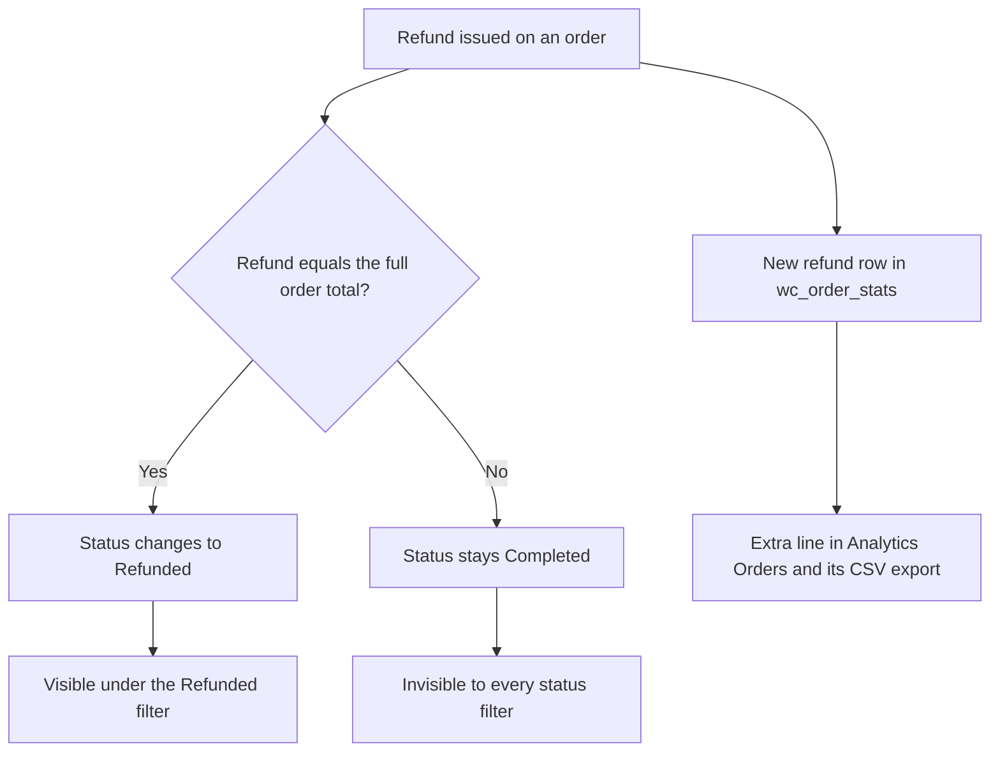

import Tldr from '../../components/Tldr.astro';

A merchant opened a support chat with me last week holding three refund rates for the same subscription product: 47%, 12%, and 28%. Same store, same product, same month. He'd pulled them from three places WooCommerce itself offers, and he asked a fair question: which one is the truth?

The three sources were the Subscriptions admin page filtered to the product and month, the Analytics Orders report filtered to the Refunded status, and a CSV export of that same Analytics report loaded into a spreadsheet. Three official views, three wildly different answers. I spent the chat tracing each number back through the WooCommerce core code, and it turned out all three were real data answering three different questions, two of them with counting traps built in.

<Tldr>
  All three numbers are real, but they measure different things. The Subscriptions page counts cancellations for any reason, refund or not. The Refunded order status only appears when the full order total is refunded, so line-item refunds on multi-product orders never show there. And the Analytics Orders CSV exports every refund as its own row carrying the parent order's status, so refunded customers get counted twice. Track your cancellation rate from the Subscriptions page and your refund money by summing the negative rows in the Orders export.
</Tldr>

Numbers and identifying details below are changed to keep the store anonymous. The mechanics are exactly as I traced them in the code.

## Three reports, three answers

The product is an annual membership subscription at $199, sold for less than a year, so no renewals yet. It's almost always bought inside a larger order together with two or three one-time products. That detail turns out to matter more than anything else.

For one month, the merchant saw 220 subscriptions on the Subscriptions page, 105 of them cancelled, which he read as a 47.7% refund rate. Analytics Orders showed 180 completed orders and only 20 with the Refunded status, so 11%. And his CSV export of the same Analytics view had 250 rows, 70 of which he'd classified as refunds, giving 28%.

## The Subscriptions page counts cancellations, not refunds

The month dropdown on the Subscriptions list filters by creation date. With [High-Performance Order Storage](https://woocommerce.com/document/high-performance-order-storage/) enabled, that's handled in `src/Internal/Admin/Orders/ListTable.php`, which translates the selected month into a `date_created` range on the query. So the page shows every subscription created that month, whatever its status is today.

Two things follow from that. Cancelled means cancelled for any reason, with or without money returned, because subscriptions have no refunded status at all. And the total includes subscriptions still sitting in Pending, which are signups whose payment never completed. In this store, 23 of the 220 had never been paid.

So 47.7% is a cancellation rate for that month's cohort. It's a real and useful number, arguably the most honest churn measure for a young annual product, but it isn't a refund rate.

## Why the Refunded status misses most refunds

An order only moves to the Refunded status when the entire order total has been refunded. The logic lives in `wc_create_refund()` in `includes/wc-order-functions.php`: after creating the refund, WooCommerce checks whether any refundable amount remains. If some does, it fires `woocommerce_order_partially_refunded` and leaves the status alone. Only when nothing remains does it set the status to Refunded, through the `woocommerce_order_fully_refunded_status` filter.

Remember that this subscription is almost always sold inside a bundle order. When a customer asks for their membership money back, the merchant refunds that one line item, $199 out of a $300 or $400 order. That's a partial refund. The order keeps its Completed status forever, and the Refunded status filter never sees it.

That's why the 20 orders under the Refunded filter were such an undercount. They were only the orders where everything had been refunded. The other fifty-plus refunds that month were invisible to any status-based search.

## The CSV export counts refunded customers twice

The 250-row export was the most confusing of the three, and the explanation is my favorite part of the trace.

WooCommerce Analytics keeps its own lookup table, `wp_wc_order_stats`, and it stores each refund as its own row in that table. You can see it in `src/Admin/API/Reports/Orders/Stats/DataStore.php`: when the synced object is a `shop_order_refund`, the row gets the refund's own date but the parent order's status. So a June refund of a June order produces two June rows, the sale and the refund, and both say Completed.

In the export, refund rows are easy to spot once you know they exist. They show a negative Net Sales value, an Items sold count of -1, and the customer type Returning. The merchant had read them as cancelled customers, which is close to true, but he divided 70 refund rows by all 250 rows. Every refunded customer sat in both the numerator and the denominator, once as a sale and once as a refund, and the 28% was an artifact of that double counting.

There's a second, subtler trap: refund rows are dated by refund date, not order date. A monthly export picks up refunds for orders placed the previous month and misses refunds issued after the month ends. Anyone measuring a cohort this way gets bleed in both directions.

## The Products report hides refunds in plain sight

Mid-chat the merchant checked Analytics, Products, saw a Gross of $22,089 against a Net of $21,890, and concluded his refunds were tiny, one unit's worth. What that page actually does is subtract itemized refunds from both columns before displaying them.

His real month was 180 units sold at $199, which is $35,820, minus 70 refunds worth $13,930, leaving $21,890. That's the Net figure exactly. Of those 70 refunds, 69 were itemized against the product line, and those 69 also subtract from Gross and from Items sold: $35,820 minus 69 times $199 is $22,089, and 180 minus 69 is the 111 units the page showed. The one refund entered as a plain amount, with no line items, is the entire $199 gap he could see between Gross and Net.

Every number on that screen was correct. None of them was readable as a refund figure, because the report folds refunds into the totals instead of showing them as their own column.

## What to actually track

After all the tracing, the routine I left the merchant with is two numbers from two places, once a month.

1. Cancellation rate: Subscriptions page, filtered to the product and month, Cancelled divided by Total. That's the cohort churn.
2. Refund money: the Analytics Orders export with the product filter on, then a SUMIF over the negative Net Sales values. That's the exact amount returned, per product, no status filters involved.

If you want a store-wide trend without spreadsheets, the legacy report under WooCommerce, Reports, Subscriptions, Subscription Events by Date charts signups against cancellations over time, and it's been HPOS-compatible since [WooCommerce Subscriptions](https://woocommerce.com/products/woocommerce-subscriptions/) 7.8.0. It covers all subscription products together, so treat it as a trend line, not a per-product rate. For a live per-product refund dashboard, a reporting tool like [Metorik](https://metorik.com/) is the usual answer, because core Analytics genuinely doesn't have that column.

The general lesson sits underneath all three traps: order statuses are operational states, not reporting categories. A status tells you where an order is in its lifecycle. The moment you use it to count money, you inherit every rule about when that status does and doesn't change, and most of those rules were never designed with your spreadsheet in mind.
